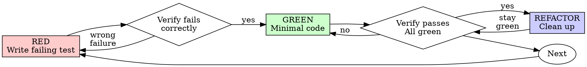

# Test-Driven Development (TDD)

## Overview

Write the test first. Watch it fail. Write minimal code to pass.

**Core principle:** If you didn't watch the test fail, you don't know if it tests the right thing.

**Violating the letter of the rules is violating the spirit of the rules.**

## Usage Criteria

**Always:**
- New features
- Bug fixes
- Refactoring
- Behavior changes

**For exploratory coding:** Use `/tdd --spike` mode (see Mode: SPIKE section below).

Thinking "skip TDD just this once"? Stop. That's rationalization.

## Constraint: The Iron Law

```
NO PRODUCTION CODE WITHOUT A FAILING TEST FIRST
```

Write code before the test? Delete it. Start over.

**No exceptions:**
- Don't keep it as "reference"
- Don't "adapt" it while writing tests
- Don't look at it
- Delete means delete

Implement fresh from tests. Period.

## Process: Red-Green-Refactor



### RED - Write Failing Test

1. List the key edge cases for this feature
2. Start with the most critical case — write one minimal failing test
3. Complete the Red-Green-Refactor cycle for this test, then move to the next

**Examples use Python for readability. Apply the same pattern in your project's language.**

<Good>
```python
def test_retries_failed_operations_3_times(self):
    attempts = {'count': 0}
    def operation():
        attempts['count'] += 1
        if attempts['count'] < 3:
            raise RuntimeError('fail')
        return 'success'

    result = retry_operation(operation)

    self.assertEqual(result, 'success')
    self.assertEqual(attempts['count'], 3)
```
Clear name, tests real behavior, one thing
</Good>

<Bad>
```python
def test_retry_works(self):
    mock_fn = Mock(side_effect=[RuntimeError(), RuntimeError(), 'success'])
    retry_operation(mock_fn)
    self.assertEqual(mock_fn.call_count, 3)
```
Vague name, tests mock not code
</Bad>

**Requirements:**
- One behavior
- Clear name
- Real code (no mocks unless unavoidable)

### Verify RED - Watch It Fail

**MANDATORY. Never skip.**

```bash
# Run your project's test command
python -m unittest path.to.test.TestClass.test_method
```

Confirm:
- Test fails (not errors)
- Failure message is expected
- Fails because feature missing (not typos)

**Test passes?** You're testing existing behavior. Fix test.

**Test errors?** Fix error, re-run until it fails correctly.

### GREEN - Minimal Code

Write simplest code to pass the test.

<Good>
```python
def retry_operation(fn, max_retries=3):
    for i in range(max_retries):
        try:
            return fn()
        except Exception:
            if i == max_retries - 1:
                raise
    # Just enough to pass
```
Just enough to pass
</Good>

<Bad>
```python
def retry_operation(fn, max_retries=3, backoff='linear',
                    on_retry=None, jitter=False):
    # YAGNI — Over-engineered
    pass
```
Over-engineered
</Bad>

Don't add features, refactor other code, or "improve" beyond the test.

### Verify GREEN - Watch It Pass

**MANDATORY.**

```bash
# Run your project's test command
python -m unittest path.to.test.TestClass
```

Confirm:
- Test passes
- Other tests still pass
- Output pristine (no errors, warnings)

**Test fails?** Fix code, not test.

**Other tests fail?** Fix now.

### REFACTOR - Clean Up

After green only:
- Remove duplication
- Improve names
- Extract helpers

Keep tests green. Don't add behavior.

### Repeat

Next failing test for next feature.

## Criteria: Test Quality

| Quality | Good | Bad |
|---------|------|-----|
| **Minimal** | One thing. "and" in name? Split it. | `test_validates_email_and_domain_and_whitespace()` |
| **Clear** | Name describes behavior | `test_1()` |
| **Shows intent** | Demonstrates desired API | Obscures what code should do |

## Protocol: Resistance Handling

When tempted to skip TDD, follow this protocol:

1. **Implementation urge** — Want to code before testing?
   → Stop. Write a test defining the success criteria first.

2. **"Already tested manually"** — Verified via console/UI?
   → Convert that manual verification into a rerunnable test script immediately.

3. **"Deleting feels wasteful"** — Invested hours in untested code?
   → Recognize sunk cost fallacy. Delete and rewrite with TDD — it's faster than debugging.

4. **"Too simple to need tests"** — Feels like overkill?
   → Simple code breaks too. A test takes 30 seconds. Just do it.

5. **"Need to explore first"** — Don't know the approach yet?
   → Explore freely, then delete ALL exploration code. Start fresh with TDD. (Or use `--spike` mode)

For the complete list of rationalizations and rebuttals, see [common-rationalizations.md](common-rationalizations.md)

## Mode: SPIKE

Invoke with `/tdd --spike` for exploratory coding:
- Prototyping without tests is allowed
- After exploration, delete ALL spike code
- Re-implement from scratch using standard TDD cycle

Without `--spike`, strict TDD mode applies. No exceptions.

## Example: Bug Fix

**Bug:** Empty email accepted

**RED**
```python
def test_rejects_empty_email(self):
    result = submit_form({'email': ''})
    self.assertEqual(result['error'], 'Email required')
```

**Verify RED**
```bash
$ python -m unittest tests.test_form.TestFormValidation.test_rejects_empty_email
FAIL: expected 'Email required', got None
```

**GREEN**
```python
def submit_form(data):
    if not data.get('email', '').strip():
        return {'error': 'Email required'}
    # ...
```

**Verify GREEN**
```bash
$ python -m unittest tests.test_form.TestFormValidation
PASS
```

**REFACTOR**
Extract validation for multiple fields if needed.

## Verification Checklist

Before marking work complete:

- [ ] Every new function/method has a test
- [ ] Watched each test fail before implementing
- [ ] Each test failed for expected reason (feature missing, not typo)
- [ ] Wrote minimal code to pass each test
- [ ] All tests pass
- [ ] Output pristine (no errors, warnings)
- [ ] Tests use real code (mocks only if unavoidable)
- [ ] Edge cases and errors covered
- [ ] **Self-check: Review each item above. If uncertain about any, return to that step and re-verify before proceeding.**

Can't check all boxes? You skipped TDD. Start over.

## Troubleshooting

| Problem | Solution |
|---------|----------|
| Don't know how to test | Write wished-for API. Write assertion first. Ask your human partner. |
| Test too complicated | Design too complicated. Simplify interface. |
| Must mock everything | Code too coupled. Use dependency injection. |
| Test setup huge | Extract helpers. Still complex? Simplify design. |

## Process: Debugging

Bug found? Write failing test reproducing it. Follow TDD cycle. Test proves fix and prevents regression.

Never fix bugs without a test.

## Anti-Patterns

When adding mocks or test utilities, read [testing-anti-patterns.md](testing-anti-patterns.md) to avoid common pitfalls:
- Testing mock behavior instead of real behavior
- Adding test-only methods to production classes
- Mocking without understanding dependencies

## Constraint: Completion

```
Production code → test exists and failed first
Otherwise → not TDD
```

No exceptions without `--spike` mode.
