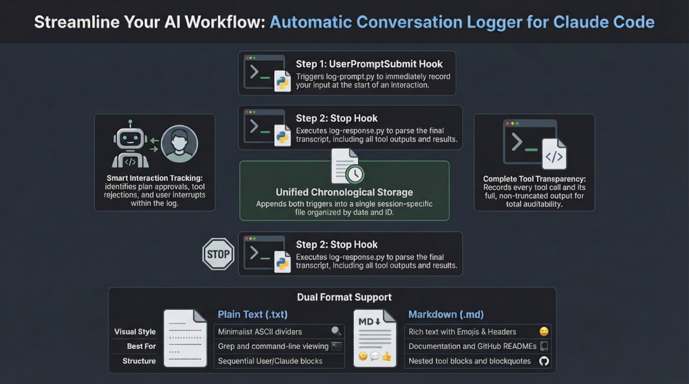
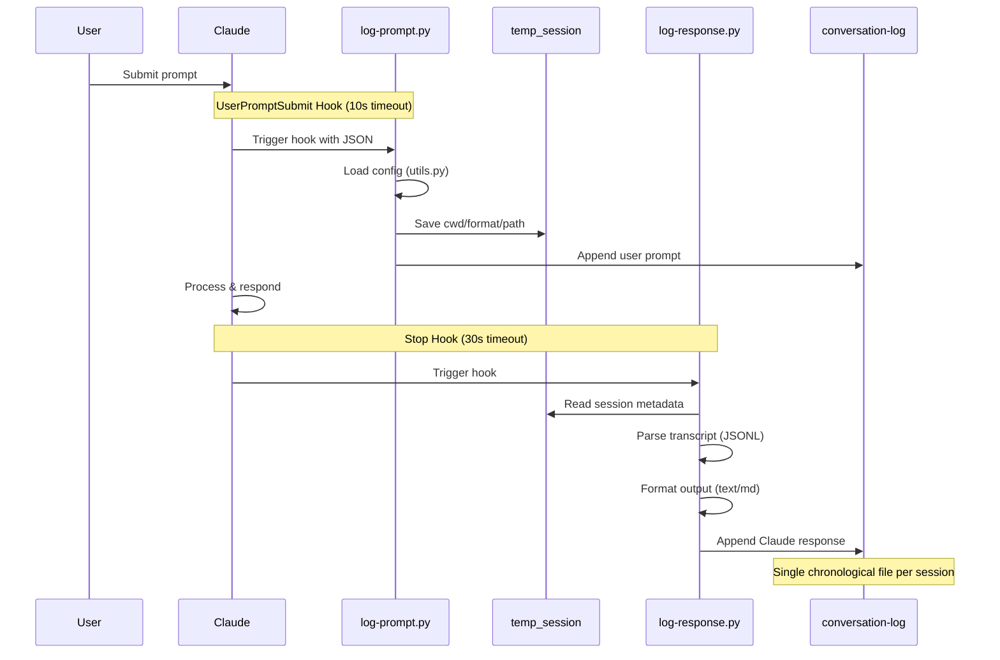
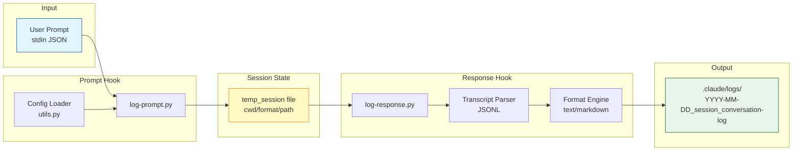
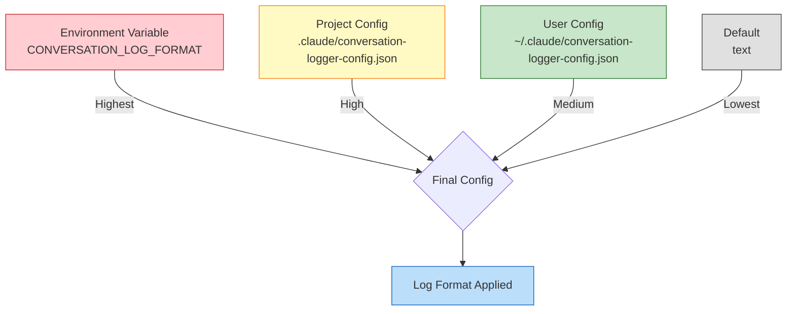

# conversation-logger

A Claude Code plugin that automatically logs conversations. Records prompts and responses chronologically in a single file, including tool usage tracking.



## Features

- Prompts and responses recorded sequentially in a single file
- Log files separated by date and session ID
- **Configurable log format**: plain text (default) or Markdown
- Speaker identification with emoji markers
- Tool usage and result tracking (full output, no truncation)
- Follow-up interaction support (user answers, plan approval/rejection, interrupt)
- Duplicate logging prevention
- Dynamic backtick fencing to prevent Markdown code block collision

## How It Works

This plugin uses two Claude Code hooks that work together:

1. **UserPromptSubmit** hook triggers `log-prompt.py` to record the user's input immediately
2. **Stop** hook triggers `log-response.py` to parse the session transcript and record Claude's response, including all tool usage

Both outputs are appended to a single chronological log file per session.

### Architecture Overview



### Data Flow



### Configuration Priority



## Installation

### Via Marketplace

```bash
# 1. Add marketplace
/plugin marketplace add ecorheim/conversation-logger

# 2. Install plugin
/plugin install conversation-logger@ecorheim-plugins
```

### Local Installation (Development/Testing)

```bash
claude --plugin-dir ./conversation-logger
```

### Requirements

- Claude Code v1.0.33 or later
- Python 3.6 or later (`python` must be available in PATH)
  - Windows: Ensure "Add Python to PATH" is checked during installation

## Configuration

### Setup Command

Run the setup command to configure the log format interactively:

```
/conversation-logger:setup
```

This will guide you through:
1. Choosing a scope (global or project)
2. Choosing a format (text or markdown)
3. Saving the configuration

### Config File Locations

| Scope | Path | Purpose |
|-------|------|---------|
| Global | `~/.claude/conversation-logger-config.json` | Applies to all projects |
| Project | `{project}/.claude/conversation-logger-config.json` | Applies to this project only |

### Config Format

```json
{
  "log_format": "markdown"
}
```

Valid values: `"text"` (default), `"markdown"`

### Priority Chain

```
Environment Variable > Project Config > User (Global) Config > Default ("text")
```

You can also set the format via environment variable:

```bash
export CONVERSATION_LOG_FORMAT=markdown
```

## Log Formats

### Text Format (Default)

Filename: `{project}/.claude/logs/YYYY-MM-DD_{session_id}_conversation-log.txt`

```
================================================================================
[YYYY-MM-DD HH:MM:SS] Session: abc123def456
================================================================================
USER:
Write a hello world program in Python
--------------------------------------------------------------------------------
CLAUDE [YYYY-MM-DD HH:MM:SS]:
● Here's a simple Hello World program in Python.

● Write(file_path=hello.py)
  ⎿  print('Hello, World!')
================================================================================
```

### Markdown Format

Filename: `{project}/.claude/logs/YYYY-MM-DD_{session_id}_conversation-log.md`

````markdown
# Conversation Log — 2026-02-09

---

## 👤 User — 08:17:27
> Session: `abc123`

Write a hello world program

## 🤖 Claude — 08:21:57

Here's the program.

### 🛠️ Tool: `Write`
> file_path=hello.py
`````
print('Hello, World!')
`````

---

## 💬 User — 08:22:30
> **Answer**

Can you add a name parameter?

## 🤖 Claude — 08:23:15

Updated the program to accept a name parameter.

### 🛠️ Tool: `Edit`
> file_path=hello.py
````

#### Markdown Interaction Types

| Type | Heading | Blockquote |
|------|---------|------------|
| Initial prompt | `## 👤 User — {time}` | `> Session: \`{id}\`` |
| Answer | `## 💬 User — {time}` | `> **Answer**` |
| Plan Approved | `## ✅ User — {time}` | `> **Plan Approved**` |
| Tool Rejected | `## ❌ User — {time}` | `> **Tool Rejected**: {reason}` |
| Interrupt | `## ⚡ User — {time}` | `> **Interrupted**` |

## Plugin Structure

```
conversation-logger/
├── .claude-plugin/
│   ├── plugin.json          # Plugin metadata
│   └── marketplace.json     # Marketplace catalog
├── commands/
│   └── setup.md             # Setup slash command
├── hooks/
│   └── hooks.json           # Hook config (UserPromptSubmit, Stop)
├── scripts/
│   ├── utils.py             # Shared utilities
│   ├── log-prompt.py        # Prompt logging script
│   └── log-response.py      # Response logging script
├── docs/
│   ├── prd/                 # Product requirement documents
│   ├── design/              # Design documents
│   └── guides/              # User guides
├── CONTRIBUTING.md
├── README.md
├── LICENSE
└── CHANGELOG.md
```

## Viewing Logs

```bash
# View today's logs (text format)
cat .claude/logs/$(date +%Y-%m-%d)_*_conversation-log.txt

# View today's logs (markdown format)
cat .claude/logs/$(date +%Y-%m-%d)_*_conversation-log.md

# Real-time monitoring
tail -f .claude/logs/*_conversation-log.*
```

## Security Notice

Log files contain all conversation content. Be cautious when entering sensitive information such as API keys or passwords.

```bash
# Set log file permissions
chmod 600 .claude/logs/*
chmod 700 .claude/logs
```

## License

MIT