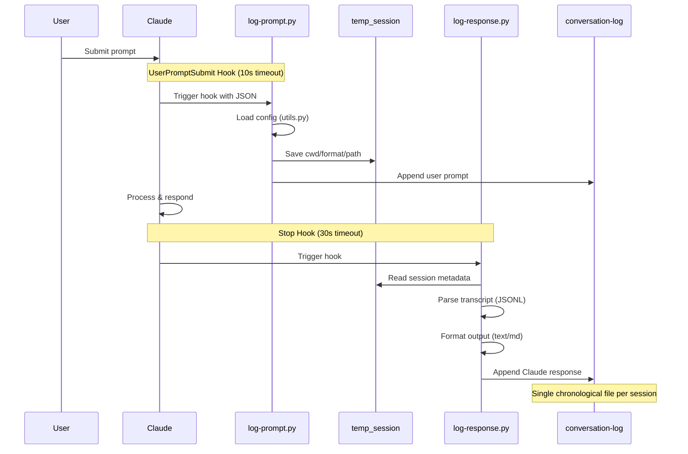
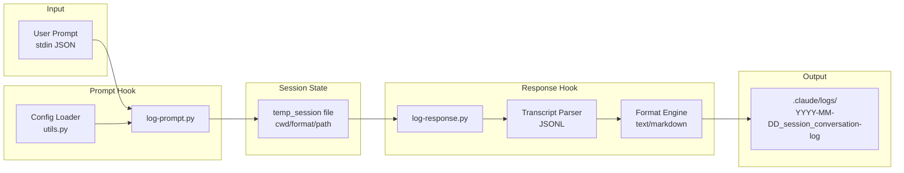
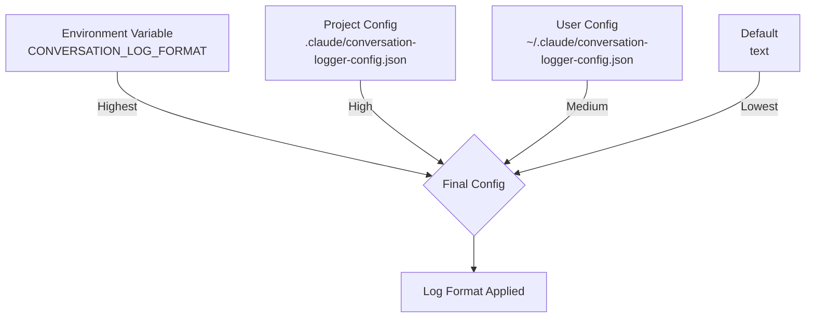

# Architecture

## How It Works

This plugin uses eight Claude Code hooks that work together:

1. **SessionStart** hook triggers `log-event.py` to record a session start marker and create session metadata
2. **UserPromptSubmit** hook triggers `log-prompt.py` to record the user's input immediately
3. **SubagentStart** / **SubagentStop** hooks trigger `log-event.py` to record subagent lifecycle events
4. **PostToolUseFailure** hook triggers `log-event.py` to record tool execution failures
5. **PreCompact** hook triggers `log-event.py` to record context compaction events
6. **Stop** hook triggers `log-response.py` to parse the session transcript and record Claude's response, including all tool usage
7. **SessionEnd** hook triggers `log-event.py` to record a session end marker and clean up session metadata

All outputs are appended to a single chronological log file per session.

## Architecture Overview



## Data Flow



## Configuration Priority



Configuration is loaded in priority order:
1. **Environment Variable** (`CONVERSATION_LOG_FORMAT`) — Highest priority
2. **Project Config** (`.claude/conversation-logger-config.json`) — Overrides user config
3. **User Config** (`~/.claude/conversation-logger-config.json`) — Global default
4. **Default** (`"text"`) — Fallback if no config exists

## Hook Execution Flow

### UserPromptSubmit Hook (`log-prompt.py`)

1. Receives user input via stdin (JSON format)
2. Loads configuration priority chain
3. Saves session metadata to temp file:
   - Working directory (cwd)
   - Log format (text/markdown)
   - Log file path
4. Appends formatted prompt to log file

**Timeout**: 10 seconds

### Stop Hook (`log-response.py`)

1. Reads session metadata from temp file
2. Parses session transcript (JSONL format)
3. Extracts Claude's response and tool usage:
   - Text output
   - Tool calls (name, parameters)
   - Tool results (full output, no truncation)
4. Formats output according to configured format
5. Appends to the same log file

**Timeout**: 30 seconds

## Session State Management

Session metadata is stored in a temporary file to bridge the two hooks:

**Location**: `/tmp/claude_session_{session_id}`

**Contents**:
```json
{
  "cwd": "/path/to/project",
  "format": "markdown",
  "log_file": "/path/to/project/.claude/logs/2026-02-13_abc123_conversation-log.md"
}
```

This approach ensures:
- No dependency between hook executions
- Consistent configuration across both hooks
- Resilience to hook failures (each hook is independent)

## File Organization

```
{project}/
└── .claude/
    └── logs/
        ├── 2026-02-13_abc123_conversation-log.txt
        ├── 2026-02-13_def456_conversation-log.md
        └── 2026-02-14_ghi789_conversation-log.txt
```

Each session creates a new log file with:
- Date prefix (`YYYY-MM-DD`)
- Session ID (8-character hex)
- Format-specific extension (`.txt` or `.md`)

## Error Handling

All scripts follow a consistent error handling pattern:

```python
try:
    # Main logic
except Exception as e:
    print(f"Error: {e}", file=sys.stderr)
    sys.exit(1)
```

Hook failures are logged but do not interrupt Claude's operation. Users can check `.claude/logs/` for error messages.
